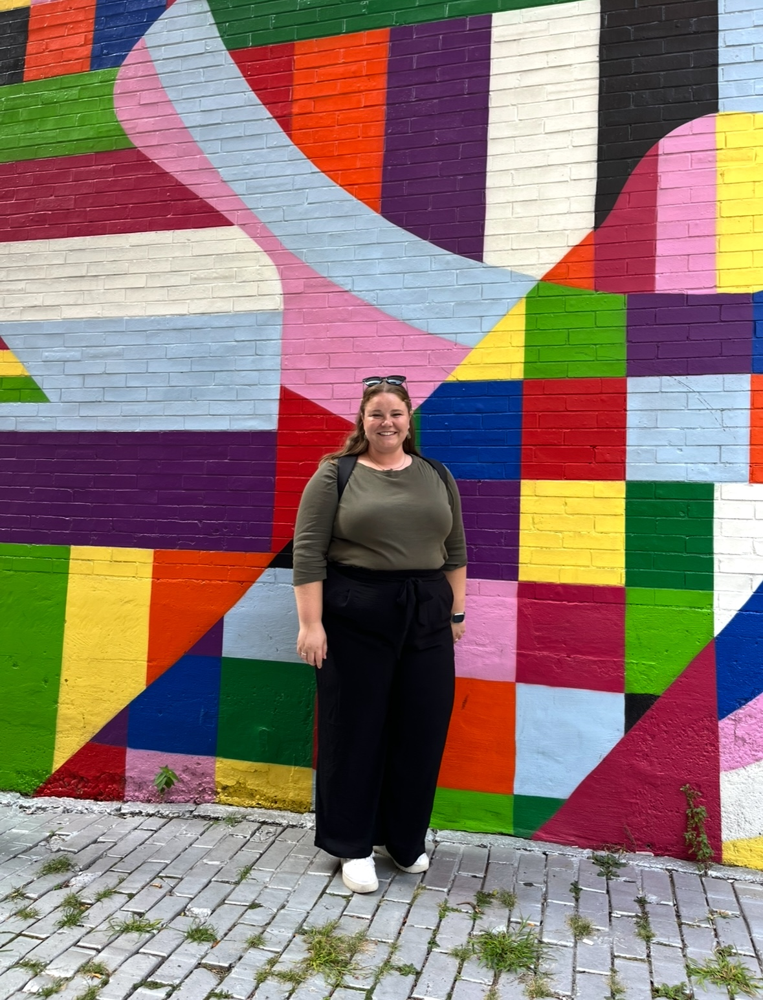

| [home page](README.md) | [data viz examples](dataviz-examples.md) | [critique by design](critique-by-design) | [final project I](final-project-part-one) | [final project II](final-project-part-two) | [final project III](final-project-part-three) |

# Portfolio
This is my public portfolio for Telling Stories with Data, a course at Carnegie Mellon University's Heinz College. Here you will be able to see my growth and deliverables in using data visualizations to tell a story. 

Web page URL: https://srchilde-coder.github.io/Telling-Stories-with-Data/
  
## About me
> Hi! My name is Samantha Childers and I am a current Master of Arts Management student at Carnegie Mellon University. As part of my studies, I have taken an interest in how to effectively communicate data with patrons, stakeholders, and audiences. Throughout this course, I hope to strength my storytelling abilities by creating effective and meaningful data visualizations. 

> Prior to attending CMU, I taught high school chorus in North Carolina for 6 years. I also did a significant amount of work in Community Arts, including community youth musical theater. I began to picture a new career for myself, one where I could expand my reach and impact within communities, while still continuing to work in music education and performance. My goal coming out of my Masters degree is to work in a performing arts nonprofit organization, potentially in education, community outreach, development, or even operations. I am using my time at CMU to learn as much as I can and to engage in all unique experiences possible. 

# What I hope to learn

1. What types of graphcis work best for different types of data or fields
2. Ways I can incorporate more data visualizations into the Arts Field
3. How to use new technologies and online tools to create graphics

# Portfolio

Data Visualizations, Critques, redesign examples, as well as my final project (and process of completing it) can be seen by clicking on the tabs linked at the top of the page. 

## Final project
My final project is a blending of two major aspects of my life: graduate school and music. Having taught high school chorus for 6 years and being a professional musician, I deeply depend on music to help me navigate life- through exciting times, stressful times, and as a way to relate to my peers. Having completed 1 full year (and one half semester) of my Masters degree, I have experienced first hand the pressure and stress that comes with a graduate degree- especially at such an academicly rigorous program like CMU and Heinz College. So I decided to use my final project to combine the two experiences: how might listening to music help graduate students reduce their stress levels?

Though there is research on music's specific effects on the body and brain, much of this field of study is new and much of the research and results are highly complex. Databases of results weren't as easy to find as I had hoped, so I decided that I would collect my own data from my colleagues through a simple survey.

My final project, which is accessible through a link on the 'Final Project III tab', tells the story of this process and communicates my findings through what I believe to be clean and clear data visualizations. 

--- 

## References & Resources
All specific citations for research are cited on each page and project. 

A few specific resources that I found useful throughout this class have been:
- Tableau
- Datawrapper
- Shorthand
- Canva
- Good old fashioned paper, pencils and felt tip markers

## AI acknowledgements
Microsoft Co-Pilot was used for 'Data visualization critique #1', September 2025. 

